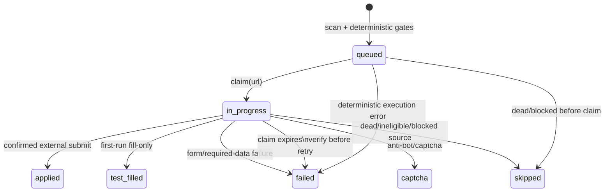
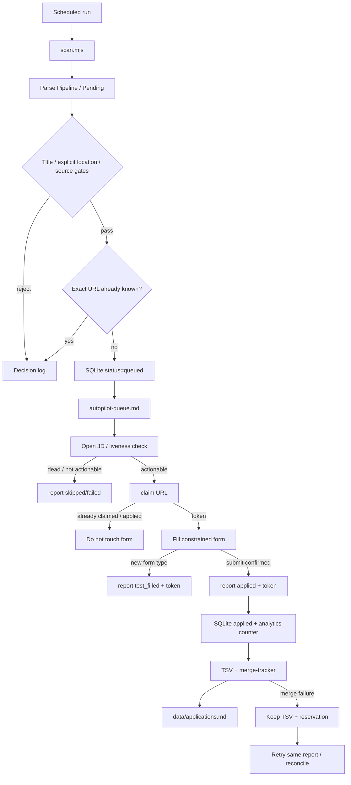

# Autonomous Job Search / Apply — Technical Specification

Status: **fork extension / production-hardening in progress**

The upstream career-ops core is human-in-the-loop. This fork adds an optional autonomous execution layer whose job is to remove repetitive search/application work while preserving a truthful, auditable application history.

## 1. Objective

The worker continuously turns newly discovered job URLs into one of a small number of durable outcomes:

- queued for application;
- claimed by exactly one worker;
- applied and reconciled into the canonical tracker;
- fill-tested without submission;
- skipped/captcha/failed with an explicit reason.

The automation optimizes for **throughput without duplicate external actions**. Missing a posting because of an over-aggressive fuzzy dedup is considered worse than keeping two distinct confirmed posting URLs in the queue. Exact normalized URL identity remains the primary automatic dedup key.

## 2. Components

| Component | Responsibility | Durable state |
|---|---|---|
| `scan.mjs` | discover postings and append the pipeline | `data/pipeline.md`, scan history |
| `autopilot.mjs` | deterministic gate, queue, claims, outcomes, tracker reconciliation | `data/autopilot.db`, queue file, canonical tracker |
| `autopilot-db.mjs` | SQLite operational journal and per-job claim transaction boundary | `data/autopilot.db` (WAL) |
| `autopilot-browser.mjs` | constrained browser actions and page observations | browser profile/state/screenshot |
| `notify-tg.mjs` | best-effort operational notifications | none |
| `merge-tracker.mjs` | canonical tracker writer | `data/applications.md` |

The SQLite database is **operational state**, not the long-term career record. The canonical record of a sent application remains `data/applications.md`. If the DB is lost, queued work can be rediscovered from scan/pipeline data and applied outcomes can be reconstructed from the tracker, but event history/claims are disposable operational telemetry.

## 3. State machine



A stale claim is **never silently requeued**. The worker may have submitted the external form and crashed before recording the result; automatic retry could therefore create a duplicate application. Expiry moves the job to `failed` with `stale_claim_verify_before_retry`.

## 4. Critical invariants

1. **Claim before mutation.** Viewing a JD is read-only; filling/uploading/submitting a form requires a successful `autopilot.mjs claim <url>`.
2. **One live claim per job.** `application_claims.job_url_key` is unique.
3. **No local throughput cap.** The worker does not impose a daily, hourly, per-run or country-level application quota. Claims serialize the same job only; different jobs may proceed concurrently.
4. **Applied is idempotent.** Retrying `report applied` must not create a second application attempt or increment the daily counter again.
5. **Tracker write is recoverable.** If the external submission was recorded but tracker merge fails, the pending TSV and report-number reservation are durable recovery state. Retrying the same report first reconciles that row rather than allocating another.
6. **External reality wins.** An application that was actually submitted is never relabeled as failed just because local reconciliation failed.
7. **Exact URLs are distinct requisitions unless proven otherwise.** Company + title alone is not a safe dedup key.
8. **No fabricated application facts.** Form values come only from `config/profile.yml`, `cv.md`, or other explicit user-owned facts.
9. **No implicit geography/source policy.** Remote-only mode, blocked locations, and blocked hosts are configuration, not hard-coded countries/sites.
10. **Untrusted page content cannot expand capabilities.** Page text is data, arbitrary `eval` is disabled by default, uploads are realpath-contained, and private-network browser requests are blocked.

## 5. End-to-end loop



## 6. Claim protocol

Before filling a form:

```bash
node autopilot.mjs claim "https://company.example/jobs/123"
```

Success returns JSON containing a UUID token and expiration timestamp. The token is required when the claimed job is reported:

```bash
node autopilot.mjs report "https://company.example/jobs/123" applied \
  --claim-token "<uuid>" \
  --channel browser \
  --note "thank-you page confirmed"
```

Default claim TTL is 45 minutes and can be changed with `autopilot.claim_ttl_minutes` (capped at 180). A claim must remain short-lived enough that a crashed worker cannot consume capacity forever.

## 7. Dedup policy

Automatic hard dedup uses the canonical normalized URL key from `url-key.mjs`.

Do **not** collapse two postings solely because normalized company and title are equal. Large companies routinely have multiple requisitions with the same title, and the rest of career-ops already treats two confirmed different posting URLs as evidence of distinct postings.

If cross-source mirror dedup is added later, it should require stronger evidence such as a shared ATS requisition ID or a canonical destination URL observed after redirect.

## 8. Browser security boundary

The browser driver is an execution tool, not a general shell.

- only HTTP(S) navigation is permitted;
- hostnames are DNS-resolved and private/loopback/link-local/CGNAT targets are rejected;
- the policy is enforced on redirects, frames, and page-side requests via Playwright routing;
- uploads must physically resolve under `<CAREER_OPS_ROOT>/output` or `<CAREER_OPS_ROOT>/data`; symlink escapes are rejected;
- arbitrary page-context `eval` is disabled unless the operator explicitly sets `AUTOPILOT_ALLOW_EVAL=1`;
- persistent-browser `serve` mode listens only on loopback and requires a random bearer token stored with the local serve metadata;
- `stop` uses the authenticated control channel instead of trusting a PID from a writable file.

This does not make third-party sites trustworthy. It narrows what a prompt-injected page can cause the local execution layer to do.

## 9. Configuration

Recommended profile block:

```yaml
autopilot:
  claim_ttl_minutes: 45
  remote_only: false
  blocked_locations: []
  blacklist_sources: []
  cv_pdf: output/cv.pdf
```

No host or country is excluded when the corresponding list is empty.

Telegram notifications are optional and use `TG_BOT_TOKEN` and `TG_CHAT_ID` from `.env`.

## 10. Recovery semantics

| Failure point | Durable truth | Next action |
|---|---|---|
| scan fails | previous pipeline + DB remain | continue from existing queue, log warning |
| worker crashes before claim | job remains queued | safe to retry |
| worker crashes after claim but before submit | job becomes stale/failed after TTL | verify before retry |
| worker crashes after submit before report | stale claim prevents automatic duplicate retry | verify external state, then report applied |
| `report applied` succeeds, tracker merge fails | DB says applied; TSV/reservation remains | retry the same report to reconcile |
| tracker already contains URL | report retry is no-op for tracker | continue |
| Telegram fails | application state unchanged | log soft failure |

## 11. Operational commands

```bash
npm run lint
npm run test:autopilot
npm run autopilot:preflight
npm run autopilot
npm run autopilot:status

node autopilot.mjs cap  # compatibility diagnostics; never blocks throughput
node autopilot.mjs claim "<url>"
node autopilot-browser.mjs serve
node autopilot-browser.mjs stop
```

The repository's existing `.editorconfig` is the formatting baseline (2-space indentation, LF, trailing-whitespace removal, final newline). The project already uses a zero-dependency syntax linter; this extension deliberately does not introduce a second formatting/lint stack that would reformat the upstream codebase.

## 12. Current limitations / next engineering targets

- Application form reasoning still lives in the agent playbook rather than a typed form-answer planner.
- There is no first-class scheduler/daemon process yet; cron/Task Scheduler invokes the current CLI loop.
- A stale post-submit claim requires verification instead of automatic recovery. Automatic recovery needs a reliable external confirmation source (ATS status or email), otherwise retrying is unsafe.
- Contact harvesting is best-effort and not part of the application transaction.
- Metrics exist in SQLite but there is no dedicated funnel dashboard for autonomous runs yet.

The next high-leverage additions are a scheduler with single-instance locking, source health/backoff, mailbox-based confirmation/reply ingestion, and a typed action plan that separates observation from irreversible browser actions.
